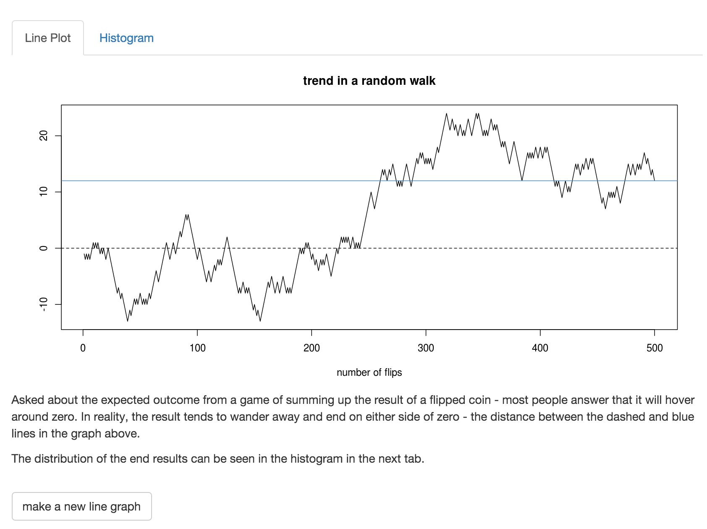
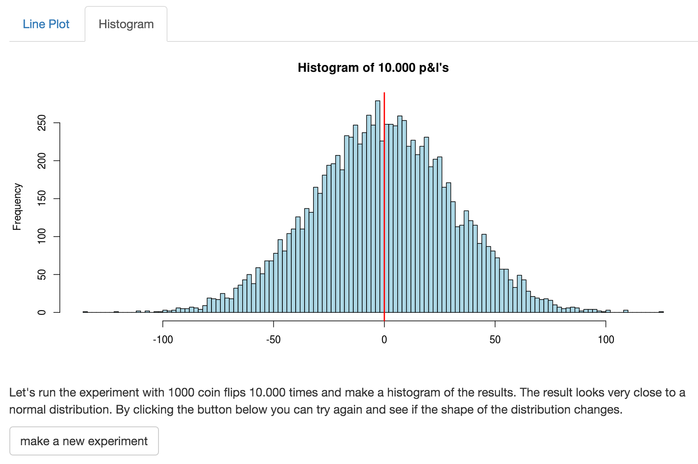

# Flip a coin
### a study in probability
<small>created by Johan Frisk</small>

---

## A coin toss simulator

We have a poor grasp on probability. Most of us have difficulties estimating 
the results of flipping a fair coin.

By using this simulator you will be able to improve your intuition about random events.

---

## How to use it

- A slider lets you decide the number of consecutive coin tosses.
- A button at the bottom of the first tab lets you prepare new plots.
- A button on the second tab lets you redraw a histogram of outcomes.

---

## Sample plots

---

## Interested?

- Visit us on shinyapps.io [Flip-a-coin](https://johanfrisk.shinyapps.io/Flip-a-coin)
- fork on Github [shiny-coin](https://github.com/johanfrisk/shiny-coin.git)

